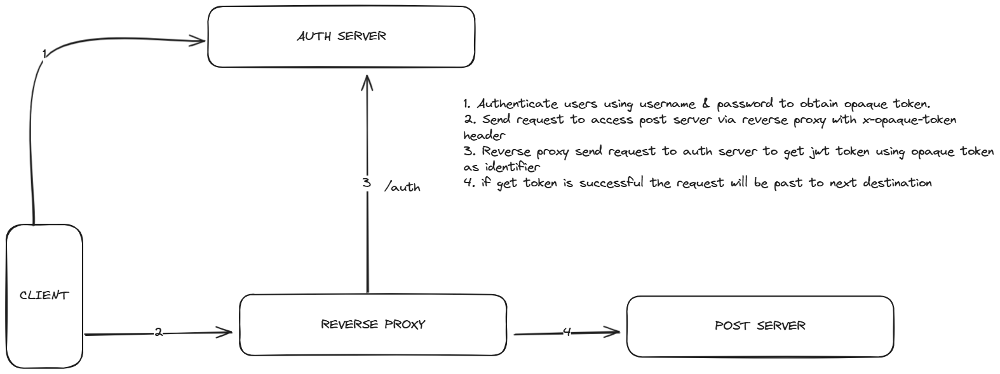

This repo is created for practicing phantom token [Phantom Token Pattern](https://curity.io/resources/learn/phantom-token-pattern/). to run this repo you need to run docker-compose `docker-compose -f docker-compose.yaml up`. Phantom Token Pattern has several advantages like
- size of the opaque token relatively small compared to jwt token because it not contains any data just random string
- no information can be leaked from opaque token

